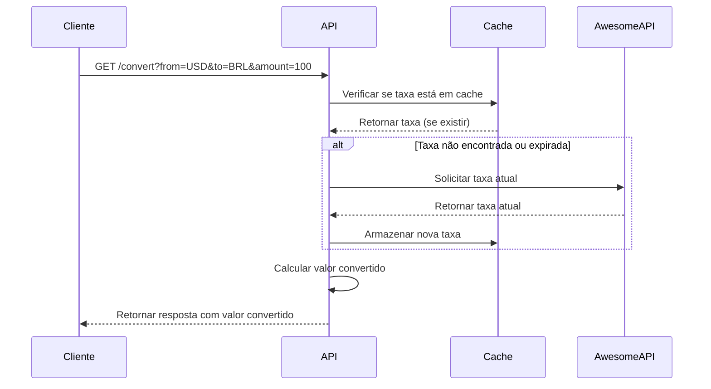

# 📋 Arquitetura da API de Conversão de Moeda

## 🏗️ Visão Geral da Arquitetura

A API de Conversão de Moeda segue uma arquitetura em camadas baseada no padrão REST, integrando dois sistemas distintos: a AwesomeAPI (serviço externo de câmbio) e um sistema de cache local em arquivo JSON.

## 🔧 Componentes da Arquitetura

### 1. Camada de Apresentação (Routes)
- Arquivo: `src/routes/currencyRoutes.js`
- Tecnologia: Express.js
- Responsabilidade: Gerenciar as requisições HTTP, validação de parâmetros e retorno de respostas
- Endpoints:
  - `GET /api/convert` - Conversão de moedas
  - `GET /api/rates` - Consulta de taxas em cache

### 2. Camada de Serviço (Service)
- Arquivo: `src/currencyService.js`
- Tecnologia: Node.js + Axios
- Responsabilidade: Implementar a lógica de negócio, integração com API externa e gestão do cache

### 3. Camada de Persistência (Cache)
- Arquivo: `src/cache.json`
- Tecnologia: Sistema de arquivos JSON
- Responsabilidade: Armazenar temporariamente as taxas de câmbio para reduzir chamadas à API externa

### 4. Sistema Externo Integrado
- AwesomeAPI: https://economia.awesomeapi.com.br
- Protocolo: REST/HTTP
- Responsabilidade: Fornecer taxas de câmbio em tempo real

## 🔄 Fluxo de Dados

### Fluxo de Conversão de Moeda:
1. Cliente envia requisição para `/api/convert`
2. API verifica se a taxa solicitada está em cache e é válida (10 minutos)
3. Se cache válido: retorna resultado do cache
4. Se cache inválido: consulta AwesomeAPI
5. AwesomeAPI retorna taxa atualizada
6. API atualiza cache com nova taxa
7. API calcula valor convertido e retorna resposta

### Diagrama de Sequência:

## 🎯 Decisões de Arquitetura

### 1. Padrão REST
- Escolha: Utilização do protocolo REST/HTTP
- Justificativa: Simplicidade, ampla adoção e compatibilidade com diversos clientes

### 2. Cache em Arquivo JSON
- Escolha: Armazenamento local em arquivo JSON em vez de banco de dados
- Justificativa: Simplicidade para o escopo do projeto e redução de dependências externas

### 3. Integração com AwesomeAPI
- Escolha: AwesomeAPI como provedor de taxas de câmbio
- Justificativa: API gratuita, sem necessidade de chave de acesso e com boa documentação

### 4. Tratamento de Erros em Camadas
- Escolha: Tratamento específico em cada camada
- Justificativa: Melhor isolamento de responsabilidades e mensagens de erro mais precisas

## 📊 Protocolos de Comunicação

| Camada         | Protocolo   | Descrição                      |
|----------------|-------------|--------------------------------|
| Cliente-API    | HTTP/REST   | Comunicação principal da API   |
| API-AwesomeAPI | HTTP/REST   | Integração com serviço externo |
| Persistência   | File System | Armazenamento em arquivo JSON  |

## 🛡️ Aspectos de Segurança

- Validação de parâmetros de entrada
- Tratamento de erros sem exposição de detalhes internos
- Timeout implícito para requisições à AwesomeAPI
- Sanitização de dados para injeção de código

## 📈 Escalabilidade

A arquitetura atual permite:
- Fácil substituição do provedor de taxas de câmbio
- Migração para sistema de cache em banco de dados
- Adição de autenticação e rate limiting
- Implementação de cache distribuído

## 🔄 Dependências do Sistema

| Componente | Versão | Tipo            |
|------------|--------|-----------------|
| Node.js    | 14+    | Runtime         |
| Express.js | 4.x    | Framework Web   |
| Axios      | 1.x    | Cliente HTTP    |
| AwesomeAPI | -      | Serviço Externo |